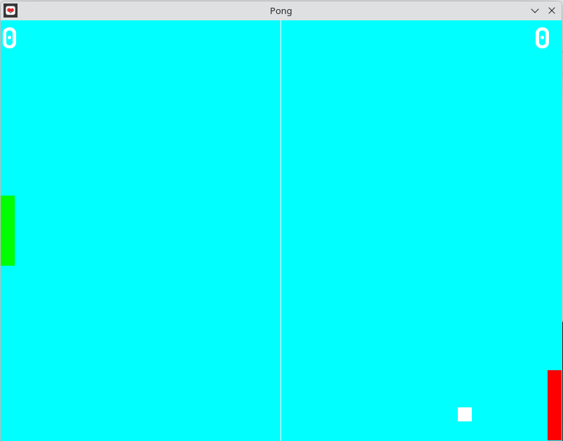

# miniature-broccoli
A Pong clone made by me using SFML.

## Visuals


## Acknowledgement
- The logo is generated by Z Image Turbo.
- The ttf used is jetbrains mono.

## What does this game has to offer?
- Buggy gameplay.
- Unbeatable opponent.
- Good Color theme.

## How to build?
- Open your terminal:
```bash
$ git clone https://github.com/himanshmewada12-spec/miniature-broccoli.git
$ cd miniature-broccoli
$ bash run.sh
```
- If you are building for the first time, uncomment the commented lines in run.sh.
- This project was made on debian. The setup on other OS will also be easy with the help of a Google Search.

## Do you want to contribute?
- Feel free to contribute anything that makes the game better.
- If you are having any problem, consider visiting [this link](https://github.com/firstcontributions/first-contributions) for help about contributing to projects.
